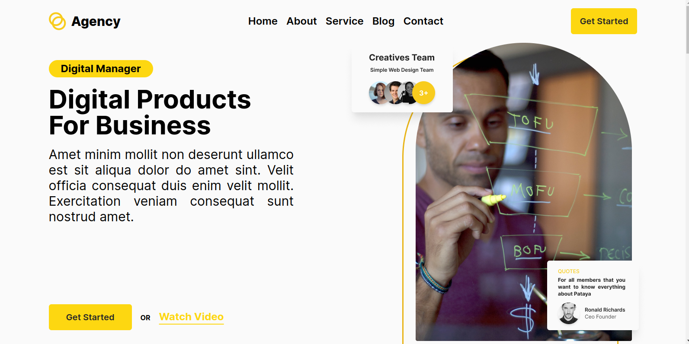

# Agency

Agency landing page with a modern and clean layout, this page features a striking hero section with a large image and bold call-to-action, along with easy-to-scan service descriptions. The featured projects section showcases the agency's best work, while the pricing and team sections provide important information about rates and expertise. Testimonials, blog content, and client logos add social proof, and a newsletter signup helps keep users engaged.

## Table of contents

- [Overview](#overview)
  - [Feature](#feature)
  - [Screenshot](#screenshot)
  - [Deploy](#deploy)
- [My process](#my-process)
  - [Built with](#built-with)
- [Author](#author)

# Overview

## Screenshot

## Deploy

- [vercel](https://agency-denny.vercel.app/)

## My process

### Built with

- React vite
- Typescript
- Tailwind

## Author

- Website - [dennyshuda](https://github.com/dennyshuda)
